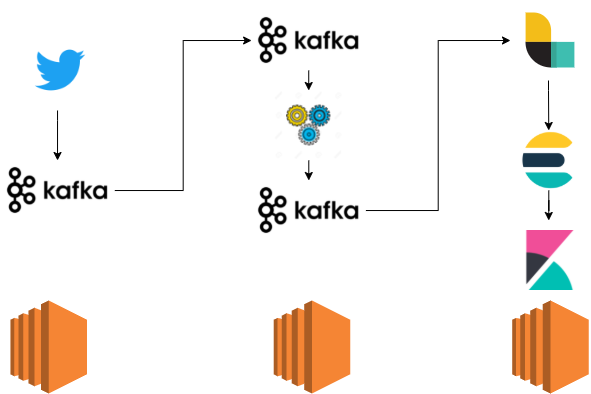

# st161220211-proyecto

Contamos con tres maquinas EC2 de AWS.
## Twitter

En una hacemos la obtención de datos de Twitter. Para eso está la carpeta llamando twitter en la cual están los código que recoge los datos y los manda por Kafka. Para ello debería actualizar mytiterKeys.py con sus credenciales de Twitter. Ya con esto puedes hacer python3 twitter2kafka.py

## Análisis

En otra maquina tenemos la parte del análisis de sentimientos al cual es la carpeta de analisis, en debes configurar settings.py para configurar los puestos de comunicación de Kafka. Se le hace una limpieza a los datos. También tener en cuenta que solo cogemos los twits que tengan exteded_tweet. Ya tenido esto en cuenta hacemos python3 sentiment_analysis.py

## ELK

Y por ultimo en la ultima maquina debemos tener instalado elastichsearch, kibana y logstach. Ya con debemos iniciar elasticsearch y kibana. Para pasar los datos de kafka a elasticsearch utilizaremos logstach con la configuración que esta en la carpeta elk. Teniendo en cuenta que logstach se ejecuta así bin/logstach le pasaremos la configuración de la siguiente manera:  bin/logstach -f etl-kafka.conf así ya recibirá los datos desde kafka y los almacenará.
